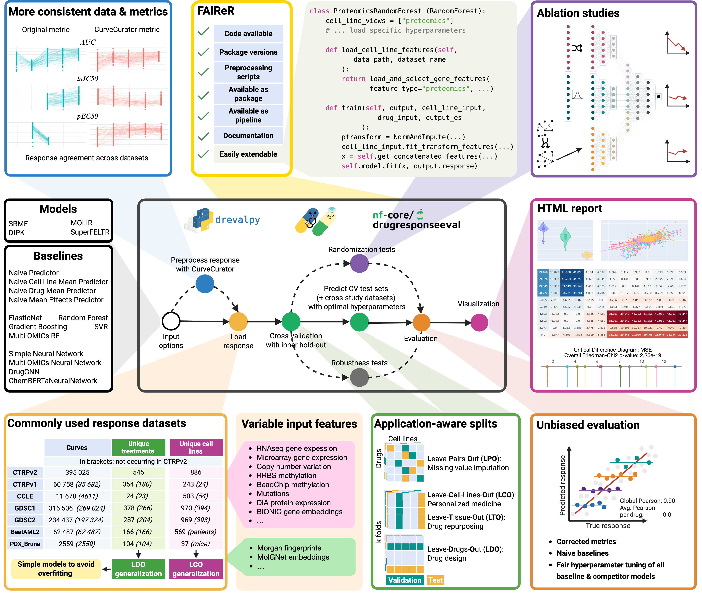

# DrEvalPy: Python Cancer Cell Line Drug Response Prediction Suite

[](https://pypi.org/project/drevalpy/)

[](https://opensource.org/licenses/GPL3)
[](https://drevalpy.readthedocs.io/)
[](https://github.com/daisybio/drevalpy/actions?workflow=Tests)
[](https://github.com/pre-commit/pre-commit)
[](https://github.com/psf/black)

**News:** Our preprint is out on [biorxiv](https://www.biorxiv.org/content/10.1101/2025.05.26.655288v1)!

Documentation at [ReadTheDocs](https://drevalpy.readthedocs.io/en/latest/index.html#).

**Focus on Innovating Your Models — DrEval Handles the Rest!**

- DrEval is a toolkit that ensures drug response prediction evaluations are statistically sound, biologically meaningful, and reproducible.
- Focus on model innovation while using our automated standardized evaluation protocols and preprocessing workflows.
- A flexible model interface supports all model types (e.g. Machine Learning, Stats, Network-based analyses)

By contributing your model to the DrEval catalog, you can increase your work's exposure, reusability, and transferability.



Use DrEval to Build Drug Response Models That Have an Impact

    1. Maintained, up-to-date baseline catalog, no need to re-implement literature models

    2. Gold standard datasets for benchmarking

    3. Consistent application-driven evaluation

    4. Ablation studies with permutation tests

    5. Cross-study evaluation for generalization analysis

    6. Optimized nextflow pipeline for fast experiments

    7. Easy-to-use hyperparameter tuning

    8. Paper-ready visualizations to display performance

This project is a collaboration of the Technical University of Munich (TUM, Germany)
and the Freie Universität Berlin (FU, Germany).

Check out our demo notebook in Colab:
[](https://colab.research.google.com/github/daisybio/drevalpy/blob/development/dreval_colab_demo.ipynb)

## Installation

Using pip:

```bash
pip install drevalpy
```

On a regular machine, the installation should take about a minute.

Using docker:

```bash
docker pull ghcr.io/daisybio/drevalpy:main
```

From source:

```bash
git clone https://github.com/daisybio/drevalpy.git
cd drevalpy
pip install poetry
pip install poetry-plugin-export
poetry install
```

Check your installation by running in your console:

```bash
drevalpy --help
```

## Quickstart

To run models from the catalog, you can run:

```bash
drevalpy --run_id my_first_run --models NaiveTissueMeanPredictor NaiveDrugMeanPredictor --dataset TOYv1 --test_mode LCO
```

This will download a small toy drug response dataset, train our baseline models which just predict the drug or tissue means or the mean drug and cell line effects.
It will evaluate in "LCO" which is the leave-cell-line-out splitting strategy using 7 fold cross validation.
The results will be stored in

```bash
results/my_first_run/TOYv1/LCO
```

You can visualize them using

```bash
drevalpy-report --run_id my_first_run --dataset TOYv1
```

This will create an index.html file in the results directory which you can open in your web browser.

You can also run a drug response experiment using Python:

```python
from drevalpy.experiment import drug_response_experiment
from drevalpy.models import MODEL_FACTORY
from drevalpy.datasets import AVAILABLE_DATASETS

from drevalpy.experiment import drug_response_experiment

naive_mean = MODEL_FACTORY["NaivePredictor"] # a naive model that just predicts the training mean
enet = MODEL_FACTORY["ElasticNet"] # An Elastic Net based on drug fingerprints and gene expression of 1000 landmark genes
simple_nn = MODEL_FACTORY["SimpleNeuralNetwork"] # A neural network based on drug fingerprints and gene expression of 1000 landmark genes

toyv1 = AVAILABLE_DATASETS["TOYv1"](path_data="data")

drug_response_experiment(
            models=[enet, simple_nn],
            baselines=[naive_mean], # Ablation studies and robustness tests are not run for baselines.
            response_data=toyv1,
            n_cv_splits=2, # the number of cross validation splits. Should be higher in practice :)
            test_mode="LCO", # LCO means Leave-Cell-Line out. This means that the test and validation splits only contain unseed cell lines.
            run_id="my_first_run",
            path_data="data", # where the downloaded drug response and feature data is stored
            path_out="results", # results are stored here :)
            hyperparameter_tuning=False) # if True (default), hyperparameters of the models and baselines are tuned.
```

This will run the Random Forest and Simple Neural Network models on the CTRPv2 dataset, using the Naive Mean Effects Predictor as a baseline. The results will be stored in `results/my_second_run/CTRPv2/LCO`.
To obtain evaluation metrics, you can use:

```python
from drevalpy.visualization.create_report import create_report

create_report(
    run_id="my_first_run",
    dataset=toyv1.dataset_name,
    path_data= "data",
    result_path="results",
)
```

We recommend the use of our Nextflow pipeline for computational demanding runs and for improved reproducibility.
No knowledge of Nextflow is required to run it. The nextflow pipeline is available here: [nf-core-drugresponseeval](https://github.com/JudithBernett/nf-core-drugresponseeval).

## Example Report

[Browse our benchmark results here.](https://dilis-lab.github.io/drevalpy-report/)
You can reproduce the whole analysis by running the following commands:

```bash
# Main run
nextflow run nf-core/drugresponseeval \
    -profile docker \
    --run_id main_results \
    --dataset_name CTRPv2 \
    --cross_study_datasets CTRPv1,CCLE,GDSC1,GDSC2 \
    --models DIPK,MultiOmicsRandomForest \
    --baselines SimpleNeuralNetwork,RandomForest,MultiOmicsNeuralNetwork,NaiveMeanEffectsPredictor,GradientBoosting,SRMF,ElasticNet,NaiveTissueMeanPredictor,NaivePredictor,SuperFELTR,NaiveCellLineMeanPredictor,NaiveDrugMeanPredictor,ProteomicsRandomForest \
    --test_mode LPO,LCO,LTO,LDO \
    --randomization_mode SVRC,SVRD \
    --randomization_type permutation \
    --measure LN_IC50

# EC50 run
nextflow run nf-core/drugresponseeval \
    -profile docker \
    --run_id ec50_run \
    --dataset_name CTRPv2 \
    --cross_study_datasets CTRPv1,CCLE,GDSC1,GDSC2 \
    --models RandomForest \
    --baselines NaiveMeanEffectsPredictor \
    --test_mode LPO,LCO,LTO,LDO \
    --measure pEC50

# AUC run
nextflow run nf-core/drugresponseeval \
    -profile docker \
    --run_id auc_run \
    --dataset_name CTRPv2 \
    --cross_study_datasets CTRPv1,CCLE,GDSC1,GDSC2 \
    --models RandomForest \
    --baselines NaiveMeanEffectsPredictor \
    --test_mode LPO,LCO,LTO,LDO \
    --measure AUC

# Invariant ablation run
nextflow run nf-core/drugresponseeval \
    -profile docker \
    --run_id invariant_ablation \
    --dataset_name CTRPv2 \
    --models MultiOmicsRandomForest,DIPK \
    --baselines NaiveMeanEffectsPredictor \
    --test_mode LPO,LCO,LDO \
    --randomization_mode SVRC,SVRD \
    --randomization_type invariant \
    --measure LN_IC50
```

## Contact

Main developers:

- [Judith Bernett](mailto:judith.bernett@tum.de), [Data Science in Systems Biology](https://www.mls.ls.tum.de/daisybio/startseite/), TUM
- [Pascal Iversen](mailto:Pascal.Iversen@hpi.de), [Data Integration in the Life Sciences](https://www.mi.fu-berlin.de/w/DILIS/WebHome), FU Berlin, Hasso-Plattner-Institut
