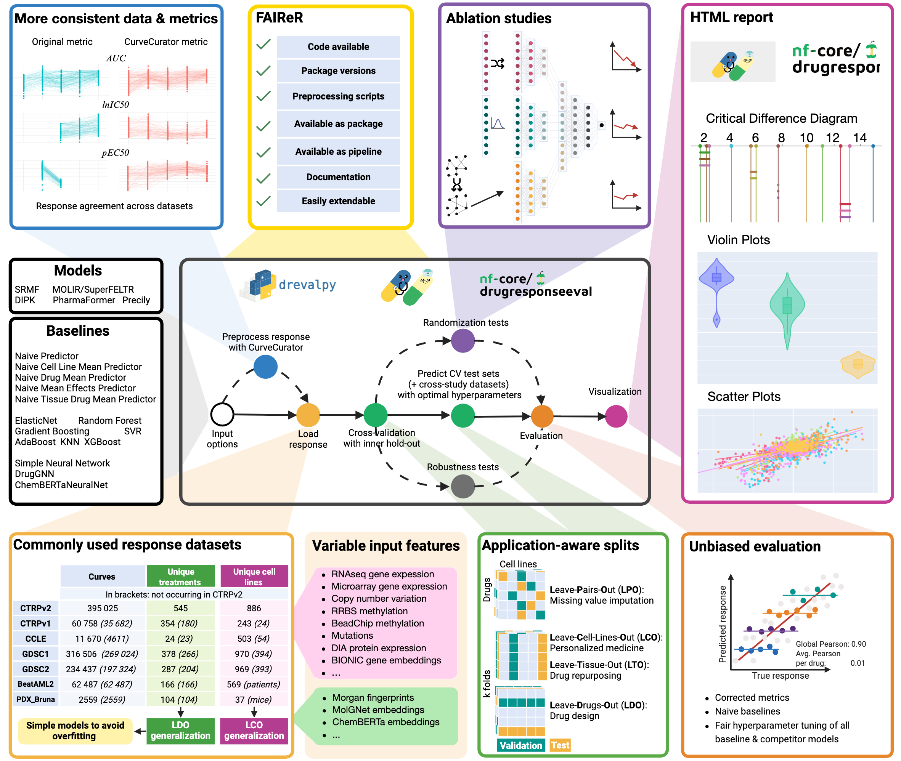

# DrEvalPy: Python Cancer Cell Line Drug Response Prediction Suite

[](https://doi.org/10.1038/s41467-026-72903-w)
[](https://pypi.org/project/drevalpy/)

[](https://opensource.org/licenses/GPL3)
[](https://drevalpy.readthedocs.io/)
[](https://github.com/daisybio/drevalpy/actions?workflow=Tests)
[](https://github.com/pre-commit/pre-commit)
[](https://github.com/psf/black)
[](https://doi.org/10.5281/zenodo.18302237)

**News:** Our paper is out on [Nature Communications](https://www.nature.com/articles/s41467-026-72903-w)!

Documentation at [ReadTheDocs](https://drevalpy.readthedocs.io/en/latest/index.html#).

**Focus on Innovating Your Models — DrEval Handles the Rest!**

- DrEval is a toolkit that ensures drug response prediction evaluations are statistically sound, biologically meaningful, and reproducible.
- Focus on model innovation while using our automated standardized evaluation protocols and preprocessing workflows.
- A flexible model interface supports all model types (e.g. Machine Learning, Stats, Network-based analyses)

By contributing your model to the DrEval catalog, you can increase your work's exposure, reusability, and transferability.



---

Use DrEval to build drug response models that have an impact

1. Maintained, up-to-date baseline catalog, no need to re-implement literature models
2. Gold standard datasets for benchmarking
3. Consistent application-driven evaluation
4. Ablation studies with permutation tests
5. Cross-study evaluation for generalization analysis
6. Optimized nextflow pipeline for fast experiments
7. Easy-to-use hyperparameter tuning
8. Paper-ready visualizations to display performance

---

<picture>
  <source media="(prefers-color-scheme: dark)" srcset="docs/_static/img/leaderboard_dark.png?v=4">
  <source media="(prefers-color-scheme: light)" srcset="docs/_static/img/leaderboard_light.png?v=4">
  
</picture>

---

This project is a collaboration of the Technical University of Munich (TUM, Germany)
and the Freie Universität Berlin (FU, Germany).

## Installation

Using pip:

```bash
pip install drevalpy
```

Ray Tune (`ray[tune]`) and Optuna are included in the default install. HPO uses
Ray to run trials and Optuna only as the search sampler — there is no
Optuna-only fallback. On Windows, HPO works with Python 3.10–3.12; with
Python 3.13+, Ray has no wheel so hyperparameter tuning is unavailable (use
Python 3.12, WSL, or Docker for HPO, or disable tuning for defaults-only runs).

On a regular machine, the installation should take about a minute.

Using docker:

```bash
docker pull ghcr.io/daisybio/drevalpy:main
```

From source:

```bash
git clone https://github.com/daisybio/drevalpy.git
cd drevalpy
uv sync
```

Check your installation:

```bash
drevalpy --help
```

Full install options (Conda, Docker, Windows HPO): [Installation](https://drevalpy.readthedocs.io/en/latest/getting_started/installation.html).

## Quickstart

DrEvalPy exposes the same evaluation workflow through the **CLI** and the **Python API**. Pick one track below; both write results into an output directory (default `results/`) that holds one subdirectory per model and one `.npz` file per cross-validation fold.

### CLI (smallest runnable example)

After installation, run naive baselines on the GDSC1 screen with leave-cell-line-out (LCO) splits:

```bash
drevalpy run NaiveTissueMeanPredictor NaiveDrugMeanPredictor NaiveMeanEffectsPredictor \
  --dataset GDSC1 \
  --split-mode LCO \
  --no-hpo
```

Models are positional arguments. This downloads GDSC1 into the system cache directory (override with the `DREVALPY_CACHE_DIR` environment variable), trains the listed models, and evaluates with the default five-fold CV. Outputs go to `results/`; use `--output-dir` to change that. Hyperparameter tuning is on by default — `--no-hpo` above keeps this first run fast.

Build the HTML report:

```bash
drevalpy report results/ --output-dir report
```

Open `report/multiqc_report.html` in your browser.

More CLI options: [CLI quickstart](https://drevalpy.readthedocs.io/en/latest/cli/quickstart.html).

### Python API

Load the dataset, resolve zoo presets with `construct_model` (returns a **class**), and pass those classes to `run`:

```python
from drevalpy.data import load
from drevalpy.models import construct_model
from drevalpy.run import run

dataset = load("GDSC1")

ElasticNet = construct_model("ElasticNet")

result = run(
    models=[ElasticNet],
    dataset=dataset,
    split_mode="LCO",
    hyperparameter_tuning=False,
)
```

With `hyperparameter_tuning=True` (the default), Ray Tune and Optuna search each model’s structured hyperparameter space. Set `hyperparameter_tuning=False` for a fast defaults-only run.

`run` returns an `ExperimentResult` holding the predictions and metrics of every fold. Save it and render the same style of HTML report from Python:

```python
from drevalpy.visualization.report import create_report

result.save("results/")

create_report(result, "report/")
```

Concepts (datasets, splits, metrics): [documentation index](https://drevalpy.readthedocs.io/en/latest/index.html). Python walkthrough: [Python quickstart](https://drevalpy.readthedocs.io/en/latest/python/quickstart.html).

### Large or highly reproducible runs

For demanding workloads, prefer the Nextflow pipeline [nf-core/drugresponseeval](https://nf-co.re/drugresponseeval/dev/) ([GitHub](https://github.com/nf-core/drugresponseeval)). No Nextflow experience is required for the standard profile.

## Example Report

[Browse our benchmark results here.](https://dilis-lab.github.io/drevalpy-report/)

The published benchmark was produced with the Nextflow pipeline
[nf-core/drugresponseeval](https://nf-co.re/drugresponseeval/dev/), which has its own
[parameter schema](https://nf-co.re/drugresponseeval/dev/parameters/) and pins the `drevalpy`
version it runs. The keys below are _pipeline_ parameters, not flags of the `drevalpy` CLI shown
above. Write each parameter set to a YAML file and hand it to Nextflow with `-params-file`:

```bash
for params in params/*.yaml; do
    nextflow run nf-core/drugresponseeval -profile docker -params-file "$params"
done
```

Main run:

```yaml
# params/main_results.yaml
run_id: main_results
dataset_name: CTRPv2
cross_study_datasets: CTRPv1,CCLE,GDSC1,GDSC2
models: DIPK,MultiViewRandomForest
baselines: SimpleNeuralNetwork,RandomForest,MultiViewNeuralNetwork,NaiveMeanEffectsPredictor,GradientBoosting,SRMF,ElasticNet,NaiveTissueMeanPredictor,NaivePredictor,SuperFELTR,NaiveCellLineMeanPredictor,NaiveDrugMeanPredictor
test_mode: LPO,LCO,LTO,LDO
randomization_mode: SVRC,SVRD
randomization_type: permutation
measure: LN_IC50
```

EC50 and AUC runs:

```yaml
# params/ec50_run.yaml
run_id: ec50_run
dataset_name: CTRPv2
cross_study_datasets: CTRPv1,CCLE,GDSC1,GDSC2,PDX_Bruna,BeatAML2
models: RandomForest
baselines: NaiveMeanEffectsPredictor
test_mode: LCO
measure: pEC50
```

```yaml
# params/auc_run.yaml
run_id: auc_run
dataset_name: CTRPv2
cross_study_datasets: CTRPv1,CCLE,GDSC1,GDSC2,PDX_Bruna,BeatAML2
models: RandomForest
baselines: NaiveMeanEffectsPredictor
test_mode: LCO
measure: AUC
```

Invariant ablation runs — run the first on CPU, and adjust the profile to use a GPU for the
second one if you can:

```yaml
# params/invariant-rf.yaml
run_id: invariant-rf
dataset_name: CTRPv2
models: MultiViewRandomForest
baselines: NaiveMeanEffectsPredictor
test_mode: LPO,LCO,LDO
randomization_mode: SVRC,SVRD
randomization_type: invariant
measure: LN_IC50
```

```yaml
# params/invariant-dipk.yaml
run_id: invariant-dipk
dataset_name: CTRPv2
models: DIPK
baselines: NaiveMeanEffectsPredictor
test_mode: LPO,LCO,LDO
randomization_mode: SVRC,SVRD
randomization_type: invariant
measure: LN_IC50
```

Inference on BeatAML2 and PDX_Bruna — again CPU for the first, GPU for the second where
available:

```yaml
# params/infer_pdx_beat.yaml
run_id: infer_pdx_beat
dataset_name: CTRPv2
cross_study_datasets: PDX_Bruna,BeatAML2
models: RandomForest,SimpleNeuralNetwork,GradientBoosting,SRMF,ElasticNet,NaivePredictor,NaiveDrugMeanPredictor,NaiveCellLineMeanPredictor
baselines: NaiveMeanEffectsPredictor
test_mode: LPO,LCO,LDO
measure: LN_IC50
```

```yaml
# params/dipk_pdx_beat.yaml
run_id: dipk_pdx_beat
dataset_name: CTRPv2
cross_study_datasets: PDX_Bruna,BeatAML2
models: DIPK
baselines: NaiveMeanEffectsPredictor
test_mode: LPO,LCO,LDO
measure: LN_IC50
```

## Development

Pre-commit runs [complexipy](https://github.com/rohaquinlop/complexipy) on the `drevalpy/` package with a maximum cognitive complexity of **15** (`[tool.complexipy]` in `pyproject.toml`). Refactors should stay at or below that limit; do not add `# complexipy: ignore` comments or exclude product paths from the hook.

## Contact

Main developers:

- [Judith Bernett](mailto:judith.bernett@tum.de), [Data Science in Systems Biology](https://www.mls.ls.tum.de/daisybio/startseite/), TUM
- [Pascal Iversen](mailto:Pascal.Iversen@hpi.de), [Data Integration in the Life Sciences](https://www.mi.fu-berlin.de/w/DILIS/WebHome), FU Berlin, Hasso-Plattner-Institut
