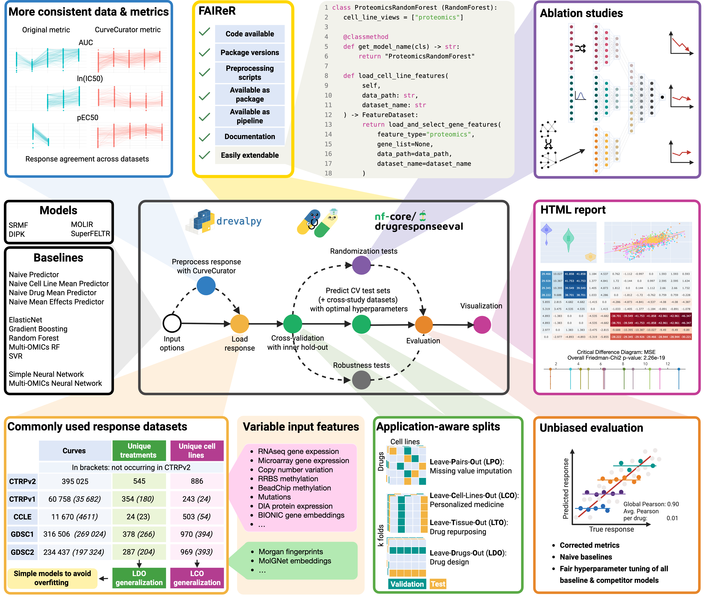

DrEvalPy: Python Cancer Cell Line Drug Response Prediction Suite
================================================================

|PyPI| |Python Version| |License| |Read the Docs| |Build| |Tests| |Codecov| |pre-commit| |Black|

.. |PyPI| image:: https://img.shields.io/pypi/v/drevalpy.svg
   :target: https://pypi.org/project/drevalpy/
   :alt: PyPI
.. |Python Version| image:: https://img.shields.io/pypi/pyversions/drevalpy
   :target: https://pypi.org/project/drevalpy
   :alt: Python Version
.. |License| image:: https://img.shields.io/github/license/daisybio/drevalpy
   :target: https://opensource.org/licenses/GPL3
   :alt: License
.. |Read the Docs| image:: https://img.shields.io/readthedocs/drevalpy/latest.svg?label=Read%20the%20Docs
   :target: https://drevalpy.readthedocs.io/
   :alt: Read the documentation at https://drevalpy.readthedocs.io/
.. |Build| image:: https://github.com/daisybio/drevalpy/actions/workflows/build_package.yml/badge.svg
   :target: https://github.com/daisybio/drevalpy/actions?workflow=Package
   :alt: Build Package Status
.. |Tests| image:: https://github.com/daisybio/drevalpy/actions/workflows/run_tests.yml/badge.svg
   :target: https://github.com/daisybio/drevalpy/actions?workflow=Tests
   :alt: Run Tests Status
.. |Codecov| image:: https://codecov.io/gh/daisybio/drevalpy/branch/main/graph/badge.svg
   :target: https://codecov.io/gh/daisybio/drevalpy
   :alt: Codecov
.. |pre-commit| image:: https://img.shields.io/badge/pre--commit-enabled-brightgreen?logo=pre-commit&logoColor=white
   :target: https://github.com/pre-commit/pre-commit
   :alt: pre-commit
.. |Black| image:: https://img.shields.io/badge/code%20style-black-000000.svg
   :target: https://github.com/psf/black
   :alt: Black

ed with CurveCurator, leading to more consistent data and metrics. DrEval supports five widely used datasets with application-aware train/test splits that enable detecting weak generalization. Models are free to use provided cell line- and drug features or custom ones. The pipeline supports randomization-based ablation studies and performs robust hyperparameter tuning for all models. Evaluation is conducted using meaningful, bias-resistant metrics to avoid inflated results from artifacts such as Simpson’s paradox. All results are compiled into an interactive HTML report.

Overview
=======

Check out our preprint on `bioRxiv <https://www.biorxiv.org/content/10.1101/2025.05.26.655288v1>`_!

**Focus on Innovating Your Models — DrEval Handles the Rest!**

-  DrEval is a toolkit that ensures drug response prediction evaluations are statistically sound, biologically meaningful, and reproducible.
-  Focus on model innovation while using our automated standardized evaluation protocols and preprocessing workflows.
-  A flexible model interface supports all model types (e.g. machine learning, statistical models, network-based analyses).

Use DrEval to build drug response models that have an impact

    1. Maintained, up-to-date baseline catalog, no need to re-implement literature models

    2. Gold standard datasets for benchmarking

    3. Consistent application-driven evaluation

    4. Ablation studies with permutation tests

    5. Cross-study evaluation for generalization analysis

    6. Optimized nextflow pipeline for fast experiments

    7. Easy-to-use hyperparameter tuning

    8. Paper-ready visualizations to display performance

This project is a collaboration of the Technical University of Munich (TUM, Germany)
and the Freie Universität Berlin (FU, Germany).
