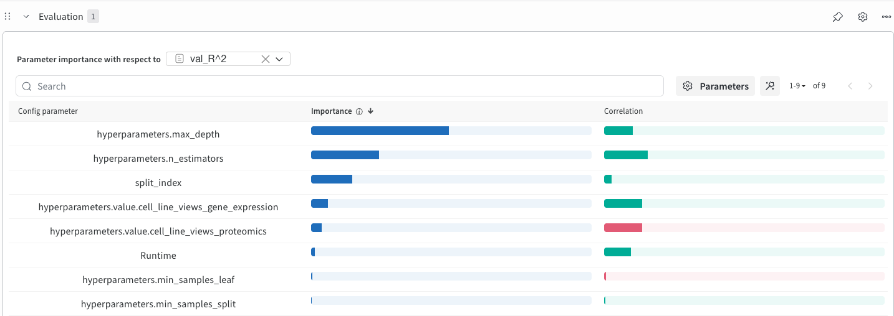
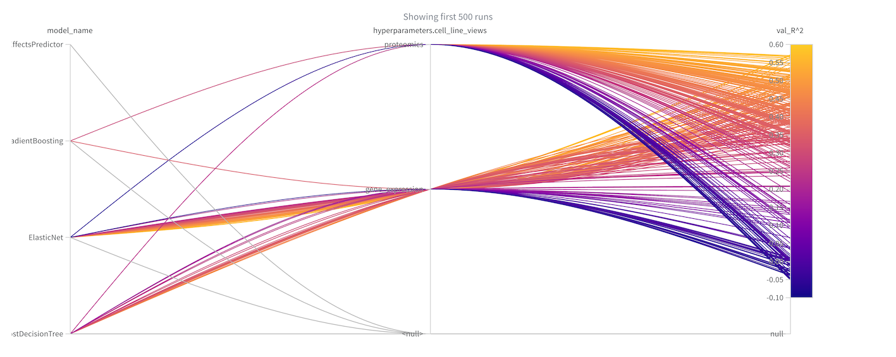
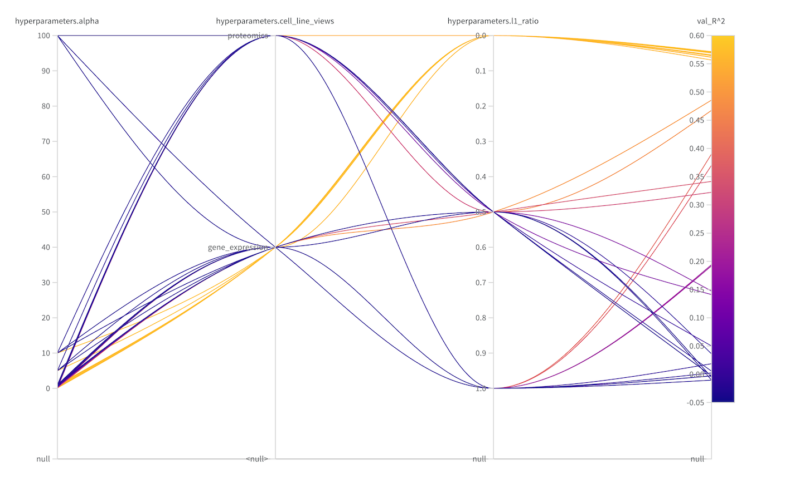

DrEvalPy and Weights & Biases
======================================

Enabling wandb
--------------

Pass ``--wandb_project`` to log a run to Weights & Biases. You will be asked for
an API key once; after that, results appear in your wandb project:

.. code-block:: bash

    drevalpy \
        --run_id my_wandb_run \
        --models RandomForest \
        --baselines ElasticNet NaiveMeanEffectsPredictor \
        --dataset_name TOYv1 \
        --path_data data \
        --wandb_project my_new_project_name

This works whether or not hyperparameter tuning is enabled.

Wandb with hyperparameter tuning
--------------------------------

Hyperparameter tuning is **on by default** (Ray Tune + Optuna). Use
``--hpo_num_samples`` for the number of trials and ``--optim_metric`` for the
metric Optuna optimizes. Pass ``--no_hyperparameter_tuning`` only if you want
each model's default hyperparameters without search.

Example: tune and compare baselines while logging to wandb:

.. code-block:: bash

    drevalpy \
        --run_id compare_baselines \
        --models RandomForest \
        --baselines ElasticNet GradientBoosting AdaBoostDecisionTree NaiveMeanEffectsPredictor \
        --dataset_name TOYv1 \
        --path_data data \
        --test_mode LPO \
        --n_cv_splits 5 \
        --optim_metric Pearson \
        --hpo_num_samples 16 \
        --hpo_random_state 42 \
        --wandb_project compare_baselines

This tunes each model for up to 16 trials per fold (when the model has a search
space), logs trials and metrics to wandb, and compares the baselines under the
same split settings.

Inspecting hyperparameter effects
---------------------------------

In the wandb UI, use ``+ Add Panels`` to add visualizations. Add
``Parameter Importance`` (for example with respect to ``val_R^2``) and select
the hyperparameters you care about:

Add a ``Parallel Coordinates Plot`` as well:

Filter to dig deeper — for example ``split_index=4`` and
``model_name="Elastic Net"``:

