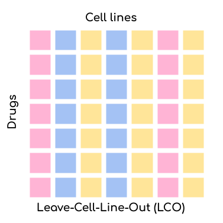

How to use DrEvalPy
===================

Here, we document how to run DrEval with our implemented models and datasets. You can either do this with the standalone
supplied here or with the associated Nextflow pipeline. We recommend the use of our nextflow pipeline for computational
demanding runs and for improved reproducibility.
No knowledge of nextflow is required to run it. The nextflow pipeline is available on the `nf-core GitHub
<https://github.com/nf-core/drugresponseeval.git>`_, the corresponding documentation can be found
`here <https://nf-co.re/drugresponseeval/dev/>`_. Documentation of the standalone is provided below.

Generate results with ``run_suite.py``
--------------------------------------

The main script to run the standalone is ``run_suite.py``. You can run it with the following command:

.. code-block:: bash

    python run_suite.py [-h] [--run_id RUN_ID] [--path_data PATH_DATA] [--models MODELS [MODELS ...]] [--baselines BASELINES [BASELINES ...]] [--test_mode TEST_MODE [TEST_MODE ...]]
                    [--randomization_mode RANDOMIZATION_MODE [RANDOMIZATION_MODE ...]] [--randomization_type RANDOMIZATION_TYPE] [--n_trials_robustness N_TRIALS_ROBUSTNESS] [--dataset_name DATASET_NAME]
                    [--cross_study_datasets CROSS_STUDY_DATASETS [CROSS_STUDY_DATASETS ...]] [--path_out PATH_OUT] [--measure MEASURE] [--curve_curator] [--curve_curator_cores CORES] [--overwrite] [--optim_metric OPTIM_METRIC] [--n_cv_splits N_CV_SPLITS]
                    [--response_transformation RESPONSE_TRANSFORMATION] [--multiprocessing]

Options:

* ``-h, --help``: Show help message and exit.
* ``--run_id RUN_ID``: Identifier for the run. Will be used as a prefix for all output files.
* ``--path_data PATH_DATA``: Path to the data directory. All data files should be stored in this directory and will be downloaded into this directory. The location of the datasets are resolved by ``<path_data>/<dataset_name>/<dataset_name>.csv``. If providing raw viability data, the file needs to be named ``<dataset_name>_raw.csv`` instead and ``--curve_curator`` needs to be specified for automated curve fitting (see ``--curve_curator`` for details and also check the :ref:`usage:Custom Datasets` section).
* ``--models MODELS [MODELS ...]``: List of models to evaluate. For a list of available models, see the :ref:`usage:Available Models` section.
* ``--baselines BASELINES [BASELINES ...]``: List of baselines to evaluate. For a list of available baselines, see the :ref:`usage:Available Models` section.
* ``--test_mode TEST_MODE [TEST_MODE ...]``: Which tests to run (LPO=Leave-random-Pairs-Out, LCO=Leave-Cell-line-Out, LDO=Leave-Drug-Out). Can be a list of test runs e.g. 'LPO LCO LDO' to run all tests. Default is LPO. For more information, see the :ref:`usage:Available Settings` section.
* ``--randomization_mode RANDOMIZATION_MODE [RANDOMIZATION_MODE ...]``: Which randomization mode to use. Can be a list of randomization modes e.g. 'SVCC SVCD SVRC SVRD' to run all randomization modes. Default is None. For more information, see the :ref:`usage:Available Randomization Tests` section.
* ``--randomization_type RANDOMIZATION_TYPE``: Which randomization type to use. Default is 'permutation'. For more information, see the :ref:`usage:Available Randomization Tests` section.
* ``--n_trials_robustness N_TRIALS_ROBUSTNESS``: Number of trials for robustness testing. Default is 0, which means no robustness testing. For more information, see the :ref:`usage:Robustness Test` section.
* ``--dataset_name DATASET_NAME``: Name of the dataset to use. For a list of available datasets, see the :ref:`usage:Available Datasets` section. For information on how to use custom datasets, see the :ref:`usage:Custom Datasets` section.
* ``--cross_study_datasets CROSS_STUDY_DATASETS [CROSS_STUDY_DATASETS ...]``: List of datasets to use for cross-study validation. For a list of available datasets, see the :ref:`usage:Available Datasets` section.
* ``--path_out PATH_OUT``: Path to the output directory. All output files will be stored in this directory.
* ``--measure MEASURE``: The name of the measure to use, default 'LN_IC50'. If using one of the available datasets (see ``--dataset_name``), this is restricted to one of ['LN_IC50', 'EC50', 'IC50', 'pEC50', 'AUC', 'response']. This corresponds to the names of the columns that contain theses measures in the provided input dataset. If providing a custom dataset, this may differ. If the option ``--curve_curator`` is set, the prefix '_curvecurator' is automatically appended, e.g. 'LN_IC50_curvecurator', to allow using the refit measures instead of the ones originally published for the available datasets, allowing for better dataset comparability (refit measures are already provided in the available datasets or computed as part of the fitting procedure when providing custom raw viability datasets, see ``--curve_curator`` for details).
* ``--curve_curator``: If set, the measure is appended with '_curvecurator'. If a custom dataset_name was provided, this will invoke the fitting procedure of raw viability data, which is expected to exist at ``<path_data>/<dataset_name>/<dataset_name>_raw.csv``. The fitted dataset will be stored in the same folder, in a file called ``<dataset_name>.csv``. Also check the :ref:`usage:Custom Datasets` section.
* ``--curve_curator_cores CORES``: Number of cores to use for CurveCurator fitting. Only used when ``--curve_curator`` is set.
* ``--overwrite``: If set, existing files will be overwritten.
* ``--optim_metric OPTIM_METRIC``: The metric to optimize for during hyperparameter tuning. Default is 'R^2'. For more information, see the :ref:`usage:Available Metrics` section.
* ``--n_cv_splits N_CV_SPLITS``: Number of cross-validation splits. Default is 7.
* ``--response_transformation RESPONSE_TRANSFORMATION``: Transformation to apply to the response data. Default is None. For more information, see the :ref:`usage:Available Response Transformations` section.
* ``--multiprocessing``: If set, multiprocessing will be used. Default is False.

Visualize results with ``create_report.py``
-------------------------------------------

Executing the ``run_suite.py`` script will generate a folder with the results which includes the predictions of all models
in all specified settings. The ``create_report.py`` will evaluate the results with all available metrics and create an
HTML report with many visualizations. You can run it with the following command:

.. code-block:: bash

    python create_report.py [-h] --run_id RUN_ID

Options:

* ``-h, --help``: Show help message and exit.
* ``--run_id RUN_ID``: Identifier for the run which was used when executing the ``run_suite.py`` script.

The report will be stored in the ``results/RUN_ID`` folder.
You can open the ``index.html`` file in your browser to view the report.

Available Settings
------------------

DrEval is designed to ensure that drug response prediction models are evaluated in a consistent and
reproducible manner. We offer three settings via the ``--test_mode`` parameter:

.. image:: ../drevalpy/visualization/style_utils/LPO.png
    :width: 25%
    :alt: Image visualizing the Leave-Pair-Out setting

.. image:: ../drevalpy/visualization/style_utils/LDO.png
    :width: 25%
    :alt: Image visualizing the Leave-Drug-Out setting

* **Leave-Pair-Out (LPO)**: Random pairs of cell lines and drugs are left out for validation/testing but both the drug and the
  cell line might already be present in the training set. This is the **easiest setting** for your model but also the
  most uninformative one. The only application scenario for this setting is when you want to test whether your model
  can **complete the missing values in the training set**.
* **Leave-Cell-Line-Out (LCO)**: Random cell lines are left out for validation/testing but the drugs might already be present in
  the training set. This setting is **more challenging** than LPO but still relatively easy. The application scenario
  for this setting is when you want to test whether your model can **predict the response of a new cell line**. This
  is very relevant for **personalized medicine or drug repurposing**.
* **Leave-Drug-Out (LDO)**: Random drugs are left out for validation/testing but the cell lines might already be present in the
  training set. This setting is the **most challenging** one. The application scenario for this setting is when you
  want to test whether your model can **predict the response of a new drug**. This is very relevant for **drug
  development**.

An underlying issue is that drugs have a rather unique IC50 range. That means that by just predicting the mean IC50
that a drug has in the training set (aggregated over all cell lines), you can already achieve a rather good
prediction. This is why we also offer the possibility to compare your model to a **NaivePredictor** that predicts
the mean IC50 of all drugs in the training set. We also offer two more advanced naive predictors:
**NaiveCellLineMeanPredictor** and **NaiveDrugMeanPredictor**. The former predicts the mean IC50 of a cell line in
the training set and the latter predicts the mean IC50 of a drug in the training set.
Finally, as the strongest naive baseline we offer the **NaiveMeanEffectPredictor**
which combines the effects of cell lines and drugs.
It is equivalent to the **NaiveCellLineMeanPredictor** and **NaiveDrugMeanPredictor** for the LDO and LPO settings, respectively.

Available Models
------------------
In addition to the Naive Predictors, we offer a variety of more advanced **baseline models** and
some **state-of-the-art models** to compare your model against. You can either set them as baselines or as models via the
``--models`` and ``--baselines`` parameters.
We first identify the best hyperparameters for all models and baselines in a cross-validation setting. Then, we
train the models on the whole training set and evaluate them on the test set.
For ``--models``, you can also perform randomization and robustness tests. The ``--baselines`` are skipped for these tests.

+----------------------------+----------------------------+--------------------------------------+--------------------------------------------------------------------------------------------------------------------------------------------------------------------------------------------------------------------------------------------------------------------------------------------------------------------------------------------------------------------------------------------------------------------------------------------------------------------------------------------------------------------------------------------------------------------------------------------+
| Model Name                 | Baseline / Published Model | Multi-Drug Model / Single-Drug Model | Description                                                                                                                                                                                                                                                                                                                                                                                                                                                                                                                                                                                |
+============================+============================+======================================+============================================================================================================================================================================================================================================================================================================================================================================================================================================================================================================================================================================================+
| NaivePredictor             | Baseline Method            | Multi-Drug Model                     | Most simple method. Predicts the mean response of all drugs in the training set.                                                                                                                                                                                                                                                                                                                                                                                                                                                                                                           |
+----------------------------+----------------------------+--------------------------------------+--------------------------------------------------------------------------------------------------------------------------------------------------------------------------------------------------------------------------------------------------------------------------------------------------------------------------------------------------------------------------------------------------------------------------------------------------------------------------------------------------------------------------------------------------------------------------------------------+
| NaiveCellLineMeanPredictor | Baseline Method            | Multi-Drug Model                     | Predicts the mean response of a cell line in the training set.                                                                                                                                                                                                                                                                                                                                                                                                                                                                                                                             |
+----------------------------+----------------------------+--------------------------------------+--------------------------------------------------------------------------------------------------------------------------------------------------------------------------------------------------------------------------------------------------------------------------------------------------------------------------------------------------------------------------------------------------------------------------------------------------------------------------------------------------------------------------------------------------------------------------------------------+
| NaiveDrugMeanPredictor     | Baseline Method            | Multi-Drug Model                     | Predicts the mean response of a drug in the training set.                                                                                                                                                                                                                                                                                                                                                                                                                                                                                                                                  |
+----------------------------+----------------------------+--------------------------------------+--------------------------------------------------------------------------------------------------------------------------------------------------------------------------------------------------------------------------------------------------------------------------------------------------------------------------------------------------------------------------------------------------------------------------------------------------------------------------------------------------------------------------------------------------------------------------------------------+
| NaiveMeanEffectPredictor   | Baseline Method            | Multi-Drug Model                     | Predicts using ANOVA-like mean effect model of cell lines and drugs                                                                                                                                                                                                                                                                                                                                                                                                                                                                                                                        |
+----------------------------+----------------------------+--------------------------------------+--------------------------------------------------------------------------------------------------------------------------------------------------------------------------------------------------------------------------------------------------------------------------------------------------------------------------------------------------------------------------------------------------------------------------------------------------------------------------------------------------------------------------------------------------------------------------------------------+
| ElasticNet                 | Baseline Method            | Multi-Drug Model                     | Fits an `Sklearn Elastic Net <https://scikit-learn.org/stable/modules/generated/sklearn.linear_model.ElasticNet.html>`_, `Lasso <https://scikit-learn.org/stable/modules/generated/sklearn.linear_model.Lasso.html>`_, or `Ridge <https://scikit-learn.org/stable/modules/generated/sklearn.linear_model.Ridge.html>`_ model on gene expression data and drug fingerprints (concatenated input matrix).                                                                                                                                                                                    |
+----------------------------+----------------------------+--------------------------------------+--------------------------------------------------------------------------------------------------------------------------------------------------------------------------------------------------------------------------------------------------------------------------------------------------------------------------------------------------------------------------------------------------------------------------------------------------------------------------------------------------------------------------------------------------------------------------------------------+
| GradientBoosting           | Baseline Method            | Multi-Drug Model                     | Fits an `Sklearn Histogram-based Gradient Boosting Regression Tree <https://scikit-learn.org/stable/modules/generated/sklearn.ensemble.HistGradientBoostingRegressor.html>`_ gene expression data and drug fingerprints.                                                                                                                                                                                                                                                                                                                                                                   |
+----------------------------+----------------------------+--------------------------------------+--------------------------------------------------------------------------------------------------------------------------------------------------------------------------------------------------------------------------------------------------------------------------------------------------------------------------------------------------------------------------------------------------------------------------------------------------------------------------------------------------------------------------------------------------------------------------------------------+
| RandomForest               | Baseline Method            | Multi-Drug Model                     | Fits an `Sklearn Random Forest Regressor <https://scikit-learn.org/stable/modules/generated/sklearn.ensemble.RandomForestRegressor.html>`_ on gene expression data and drug fingerprints.                                                                                                                                                                                                                                                                                                                                                                                                  |
+----------------------------+----------------------------+--------------------------------------+--------------------------------------------------------------------------------------------------------------------------------------------------------------------------------------------------------------------------------------------------------------------------------------------------------------------------------------------------------------------------------------------------------------------------------------------------------------------------------------------------------------------------------------------------------------------------------------------+
| MultiOmicsRandomForest     | Baseline Method            | Multi-Drug Model                     | Fits an `Sklearn Random Forest Regressor <https://scikit-learn.org/stable/modules/generated/sklearn.ensemble.RandomForestRegressor.html>`_ on gene expression, methylation, mutation, copy number variation data, and drug fingerprints (concatenated matrix). The dimensionality of the methylation data is reduced with a PCA to the first 100 components before it is fed to the model.                                                                                                                                                                                                 |
+----------------------------+----------------------------+--------------------------------------+--------------------------------------------------------------------------------------------------------------------------------------------------------------------------------------------------------------------------------------------------------------------------------------------------------------------------------------------------------------------------------------------------------------------------------------------------------------------------------------------------------------------------------------------------------------------------------------------+
| SingleDrugRandomForest     | Baseline Method            | Single-Drug Model                    | Fits an `Sklearn Random Forest Regressor <https://scikit-learn.org/stable/modules/generated/sklearn.ensemble.RandomForestRegressor.html>`_ on gene expression data for each drug separately.                                                                                                                                                                                                                                                                                                                                                                                               |
+----------------------------+----------------------------+--------------------------------------+--------------------------------------------------------------------------------------------------------------------------------------------------------------------------------------------------------------------------------------------------------------------------------------------------------------------------------------------------------------------------------------------------------------------------------------------------------------------------------------------------------------------------------------------------------------------------------------------+
| ProteomicsRandomForest     | Baseline Method            | Multi-Drug Model                     | Fits an `Sklearn Random Forest Regressor <https://scikit-learn.org/stable/modules/generated/sklearn.ensemble.RandomForestRegressor.html>`_ on proteomics data and drug fingerprints.                                                                                                                                                                                                                                                                                                                                                                                                       |
+----------------------------+----------------------------+--------------------------------------+--------------------------------------------------------------------------------------------------------------------------------------------------------------------------------------------------------------------------------------------------------------------------------------------------------------------------------------------------------------------------------------------------------------------------------------------------------------------------------------------------------------------------------------------------------------------------------------------+
| SVR                        | Baseline Method            | Multi-Drug Model                     | Fits an `Sklearn Support Vector Regressor <https://scikit-learn.org/1.5/modules/generated/sklearn.svm.SVR.html>`_ gene expression data and drug fingerprints.                                                                                                                                                                                                                                                                                                                                                                                                                              |
+----------------------------+----------------------------+--------------------------------------+--------------------------------------------------------------------------------------------------------------------------------------------------------------------------------------------------------------------------------------------------------------------------------------------------------------------------------------------------------------------------------------------------------------------------------------------------------------------------------------------------------------------------------------------------------------------------------------------+
| SimpleNeuralNetwork        | Baseline Method            | Multi-Drug Model                     | Fits a simple feedforward neural network (implemented with `Pytorch Lightning <https://lightning.ai/docs/pytorch/stable/>`_) on gene expression and drug fingerprints (concatenated input) with 3 layers of varying dimensions and Dropout layers.                                                                                                                                                                                                                                                                                                                                         |
+----------------------------+----------------------------+--------------------------------------+--------------------------------------------------------------------------------------------------------------------------------------------------------------------------------------------------------------------------------------------------------------------------------------------------------------------------------------------------------------------------------------------------------------------------------------------------------------------------------------------------------------------------------------------------------------------------------------------+
| MultiOmicsNeuralNetwork    | Baseline Method            | Multi-Drug Model                     | Fits a simple feedforward neural network (implemented with `Pytorch Lightning <https://lightning.ai/docs/pytorch/stable/>`_) on gene expression, methylation, mutation, copy number variation data, and drug fingerprints (concatenated input) with 3 layers of varying dimensions and Dropout layers. The dimensionality of the methylation data is reduced with a PCA to the first 100 components before it is fed to the model.                                                                                                                                                         |
+----------------------------+----------------------------+--------------------------------------+--------------------------------------------------------------------------------------------------------------------------------------------------------------------------------------------------------------------------------------------------------------------------------------------------------------------------------------------------------------------------------------------------------------------------------------------------------------------------------------------------------------------------------------------------------------------------------------------+
| SRMF                       | Published Model            | Multi-Drug Model                     | `Similarity Regularization Matrix Factorization <https://doi.org/10.1186/s12885-017-3500-5>`_ model by Wang et al. on gene expression data and drug fingerprints. Re-implemented Matlab code into Python. The basic idea is to represent each drug and each cell line by their respective similarities to all other drugs/cell lines. Those similarities are mapped into a shared latent low-dimensional space from which responses are predicted.                                                                                                                                         |
+----------------------------+----------------------------+--------------------------------------+--------------------------------------------------------------------------------------------------------------------------------------------------------------------------------------------------------------------------------------------------------------------------------------------------------------------------------------------------------------------------------------------------------------------------------------------------------------------------------------------------------------------------------------------------------------------------------------------+
| MOLIR                      | Published Model            | Single-Drug Model                    | Regression extension of `MOLI: multi-omics late integration deep neural network. <https://doi.org/10.1093/bioinformatics/btz318>`_ by Sharifi-Noghabi et al. Takes somatic mutation, copy number variation and gene expression data as input. MOLI reduces the dimensionality of each omics type with a hidden layer, concatenates them into one representation and optimizes this representation via a combined cost function consisting of a triplet loss and a binary cross-entropy loss. We implemented a regression adaption with MSE loss and an adapted triplet loss for regression.|
+----------------------------+----------------------------+--------------------------------------+--------------------------------------------------------------------------------------------------------------------------------------------------------------------------------------------------------------------------------------------------------------------------------------------------------------------------------------------------------------------------------------------------------------------------------------------------------------------------------------------------------------------------------------------------------------------------------------------+
| SuperFELTR                 | Published Model            | Single-Drug Model                    | Regression extension of `SuperFELT: supervised feature extraction learning using triplet loss for drug response <https://doi.org/10.1186/s12859-021-04146-z>`_ by Park et al. Very similar to MOLI(R). In MOLI(R), encoders and the classifier were trained jointly. Super.FELT(R) trains them independently. MOLI(R) was trained without feature selection (except for the Variance Threshold on the gene expression). Super.FELT(R) uses feature selection for all omics data.                                                                                                           |
+----------------------------+----------------------------+--------------------------------------+--------------------------------------------------------------------------------------------------------------------------------------------------------------------------------------------------------------------------------------------------------------------------------------------------------------------------------------------------------------------------------------------------------------------------------------------------------------------------------------------------------------------------------------------------------------------------------------------+
| DIPK                       | Published Model            | Multi-Drug Model                     | `Deep neural network Integrating Prior Knowledge <https://doi.org/10.1093/bib/bbae153>`_ from Li et al. Uses gene interaction relationships (encoded by a graph auto-encoder), gene expression profiles (encoded by a denoising auto-encoder), and molecular topologies (encoded by MolGNet). Those features are integrated using multi-head attention layers.                                                                                                                                                                                                                             |
+----------------------------+----------------------------+--------------------------------------+--------------------------------------------------------------------------------------------------------------------------------------------------------------------------------------------------------------------------------------------------------------------------------------------------------------------------------------------------------------------------------------------------------------------------------------------------------------------------------------------------------------------------------------------------------------------------------------------+

Available Datasets
------------------
We provide commonly used datasets to evaluate your model on (GDSC1, GDSC2, CCLE, CTRPv2) via the ``--dataset_name`` parameter.

+-------------------+----------------------+-----------------+---------------------+--------------------------------------------------------------------------------------------------+
| Dataset Name      | Number of DRP Curves | Number of Drugs | Number of Cell Lines| Description                                                                                      |
+===================+======================+=================+=====================+==================================================================================================+
| GDSC1             | 316,506              | 378             | 970                 | The Genomics of Drug Sensitivity in Cancer (GDSC) dataset version 1.                             |
+-------------------+----------------------+-----------------+---------------------+--------------------------------------------------------------------------------------------------+
| GDSC2             | 234,437              | 287             | 969                 | The Genomics of Drug Sensitivity in Cancer (GDSC) dataset version 2.                             |
+-------------------+----------------------+-----------------+---------------------+--------------------------------------------------------------------------------------------------+
| CCLE              | 11,670               | 24              | 503                 | The Cancer Cell Line Encyclopedia (CCLE) dataset.                                                |
+-------------------+----------------------+-----------------+---------------------+--------------------------------------------------------------------------------------------------+
| CTRPv1            | 60,758               | 354             | 243                 | The Cancer Therapeutics Response Portal (CTRP) dataset version 1.                                |
+-------------------+----------------------+-----------------+---------------------+--------------------------------------------------------------------------------------------------+
| CTRPv2            | 395,025              | 546             | 886                 | The Cancer Therapeutics Response Portal (CTRP) dataset version 2.                                |
+-------------------+----------------------+-----------------+---------------------+--------------------------------------------------------------------------------------------------+
| TOYv1             | 2,711                | 36              | 90                  | A toy dataset for testing purposes subsetted from CTRPv2.                                        |
+-------------------+----------------------+-----------------+---------------------+--------------------------------------------------------------------------------------------------+
| TOYv2             | 2,784                | 36              | 90                  | A second toy dataset for cross study testing purposes. 80 cell lines and 32 drugs overlap TOYv2. |
+-------------------+----------------------+-----------------+---------------------+--------------------------------------------------------------------------------------------------+

If using the ``--curve_curator`` option with these datasets, the desired measure provided with the ``--measure`` option is appended with "_curvecurator", e.g. "IC50_curvecurator".
In the provided datasets, these are the measures calculated with the same fitting procedure using CurveCurator. To use the measures reported from the original publications of the
dataset, do not set the ``--curve_curator`` option.

This however makes it hard to do cross-study comparisons, since the measures may not be directly comparable due to differences in the fitting procedures used by the original authors.
It is therefore recommended to always use DrEvalPy with the ``--curve_curator`` option, even when providing your own custom datasets (see next section).

Corresponding feature data
---------------------------
The datasets have corresponding cell-line and drug feature data. The sources are as follows:

* GDSC1 & 2:
    * Gene expression: RMA-normalized microarray expression data from the `GDSC Data Portal <https://www.cancerrxgene.org/downloads/bulk_download>`_ (raw data).
    * Methylation: Preprocessed Beta Values for all CpG islands, IlluminaHumanMethylation450 BeadChip `GDSC Data Portal <https://www.cancerrxgene.org/gdsc1000/GDSC1000_WebResources/Home.html>`_.
* CCLE, CTRPv1, CTRPv2:
    * Gene expression: reprocessed RNA-seq data PRJNA523380
    * Methylation: DepMap Beta Values for RRBS clusters ``CCLE_RRBS_TSS_CpG_clusters_20180614.txt``
* Used by all:
    * Mutation & CNV data: `Sanger Cell Model Passports <https://cellmodelpassports.sanger.ac.uk/downloads>`_.
    * Proteomics: Raw data at PRIDE: PXD030304
    * Morgan Fingerprints were generated with RDKit from SMILES either downloaded from PubChem or provided by GDSC.
    * `DIPK associated drive <https://drive.google.com/drive/folders/16hP48-noHi3-c_LP9TcZxkwAzqxgR0VB>`_
        * MolGNet features were generated from SMILES
        * BIONIC features were generated from top expressed genes
    * The 978 landmark genes are from the L1000 assay
    * The drug target genes are the genes targeted by the drugs used in GDSC, extractable from the `GDSC Data Portal <https://www.cancerrxgene.org/downloads/bulk_download>`_ (compounds annotation).
    * The intersection lists are features occurring in all datasets for the respective OMICs to ensure that cross-study predictions can easily be done because the features are shared.

For more information on the preprocessing, please refer to `the corresponding GitHub Repo <https://github.com/daisybio/preprocess_drp_data>`_.

Custom Datasets
---------------
You can also provide your own custom dataset via the ``--dataset_name`` parameter by specifying a name that is not in the list of the available datasets.
This can be prefit data (not recommended for comparability reasons) or raw viability data that is automatically fit with the exact same procedure that was used to refit
the available datasets in the previous section.

**Raw viability data**

* DrEvalPy expects a csv-formatted file in the location ``<path_data>/<dataset>/<dataset_name>_raw.csv`` (corresponding to the ``--path_data`` and ``--dataset_name`` options),
  which contains the raw viability data in long format with the columns ["dose", "response", "sample", "drug"] and an optional "replicate" column.
  If replicates are provided, the procedure will fit one curve per sample / drug pair using all replicates.
* The options ``--curve_curator`` and ``--curve_curator_cores`` must be set.
* Available measures are ["AUC", "pEC50", "EC50", "IC50"].
* DrEvalPy provides all results of the fitting in the same folder including the fitted curves in a file folder ``<path_data>/<dataset>/<dataset_name>.csv``

**Prefit viability data**

* DrEvalPy expects a csv-formatted file in the location ``<path_data>/<dataset>/<dataset_name>.csv`` (corresponding to the ``--path_data`` and ``--dataset_name`` options),
  with at least the columns ["cell_line_id", "drug_id", <measure>"] where <measure> is replaced with the name of the measure you provide
* Available measures depend on the column names and can be provided using the `--measure` option.
* It is required that you use measure names that are also working with the available datasets if you use the ``--cross_study_datasets`` option

Available Randomization Tests
-----------------------------

We offer the possibility to test how much the performance of your model deteriorates when you randomize the input training data.
We have several randomization modes and types available.

The modes are supplied via ``--randomization_mode`` and the types via ``--randomization_type``.:

* **SVCC: Single View Constant for Cell Lines:** A single cell line view (e.g., gene expression) is held unperturbed
  while the others are randomized.
* **SVCD: Single View Constant for Drugs:** A single drug view (e.g., drug fingerprints) is held unperturbed while the
  others are randomized.
* **SVRC: Single View Random for Cell Lines:** A single cell line view (e.g., gene expression) is randomized while the
  others are held unperturbed.
* **SVRD: Single View Random for Drugs:** A single drug view (e.g., drug fingerprints) is randomized while the others
  are held unperturbed.

Currently, we support two ways of randomizing the data. The default is permututation.

* **Permutation**: Permutes the features over the instances, keeping the distribution of the features the same but
  dissolving the relationship to the target.
* **Invariant**: The randomization is done in a way that a key characteristic of the feature is preserved. In case
  of matrices, this is the mean and standard deviation of the feature view for this instance, for networks it is the
  degree distribution.

Robustness Test
---------------

The robustness test is a test where the model is trained with varying seeds. This is done multiple times to see how
stable the model is. Via ``--n_trials_robustness``, you can specify the number of trials for the robustness tests.

*Note*: You need at least 7 trials to get a meaningful critical difference diagram and the corresponding p-values.

Available Metrics
-----------------

We offer a variety of metrics to evaluate your model on. The default is the R^2 score. You can change the metric via
the ``--optim_metric`` parameter. The following metrics are available:

* **R^2**: The coefficient of determination. The higher the better.
* **MSE**: The mean squared error. The lower the better.
* **RMSE**: The root mean squared error. The lower the better.
* **MAE**: The mean absolute error. The lower the better.
* **Pearson**: The Pearson correlation coefficient. The higher the better.
* **Spearman**: The Spearman correlation coefficient. The higher the better.
* **Kendall**: The Kendall correlation coefficient. The higher the better.
* **Normalized [R^2, Pearson, Spearman, Kendall]**: A version of the metric where the true and predicted response values are normalized by the predictions of the NaiveMeanEffectsPredictor.

Available Response Transformations
----------------------------------

We offer the possibility to transform the response data before training the model. This can be done via the
``--response_transformation`` parameter. The following transformations are available:

* **None**: No transformation is applied.
* **standard**: The `sklearn StandardScaler <https://scikit-learn.org/stable/modules/generated/sklearn.preprocessing.StandardScaler.html>`_ is applied.
* **minmax**: The `sklearn MinMaxScaler <https://scikit-learn.org/stable/modules/generated/sklearn.preprocessing.MinMaxScaler.html>`_ is applied.
* **robust**: The `sklearn RobustScaler <https://scikit-learn.org/stable/modules/generated/sklearn.preprocessing.RobustScaler.html>`_ is applied.
